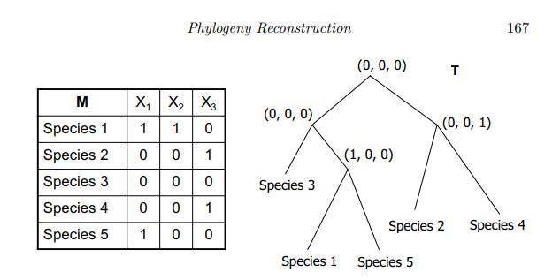
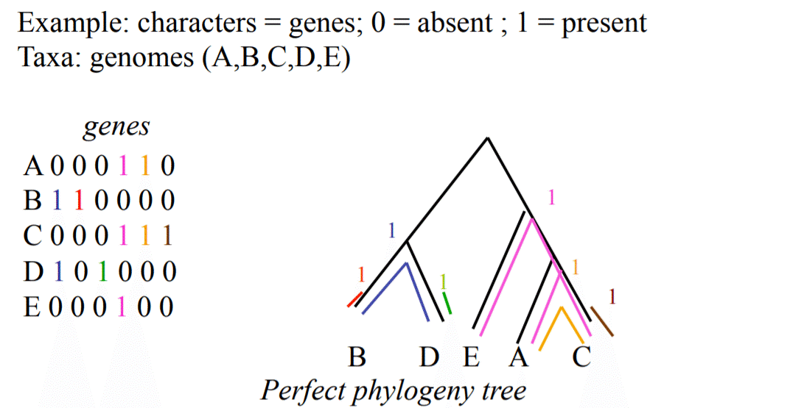
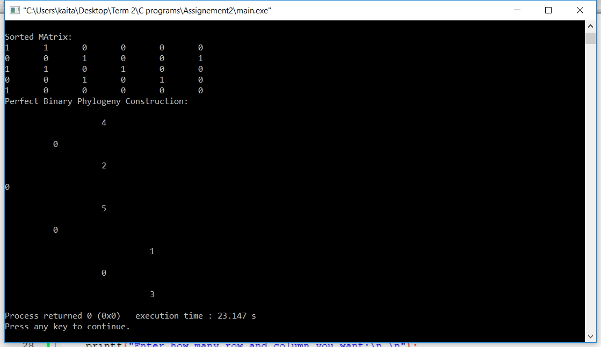

# Binary-Perfect-Phylogeny-Tree
Determine if a given character-state matrix, M, has a perfect phylogeny, using the compatability approach.
If there exists a perfect phylogeny, then the tree is constructed. 

## Perfect Phylogeny Tree

Consider a set S of n taxa, eaphylogeny_reconstruction.JPGch characterized by m characters. This input
can be expressed as an n × m character-state matrix M where Mij is the
state of character j of taxon i. For every character i, let Oi be the set of
taxa with state 1, that is, Oi = {j | Mij = 1}. For example, in Figure 7.8,
O1 = {1, 5}, O2 = {1}, and O3 = {2, 4}. For any pair of characters i and j,
they are pairwise compatible if Oi and Oj are disjoint or one of them contains the other. For example, in Figure 7.8, X1 and X2 are pairwise compatible
since O1 contains O2. X1 and X3 are pairwise compatible since O1 and O3
are disjoint. Below is the key lemma for determining compatibility.

LEMMA 7.3
M admits a perfect phylogeny if and only if every pair of characters i and j
are pairwise compatible.

Below Image shows the example which can be used to test the algorithm:

Steps to run the code:
I have attached C main program file, just Import the file and run the program.

## Steps to test the code:

The code will first ask the no of rows and columns. 
User must enter the matrix column wise.
It will then check for the perfect phylogeny, if the matrix is not perfect phylogeny then it will return stating the message. 
If the matrix is perfect phylogeny, then the tree will be constructed and printed as shown below.
Please note that the index(objects) will start from 1. 0/zero shown in the tree is empty node. 
The tree is constructed side ways, as shown below in the output.

Limitation of code:
- Implemented code works only for Binary matrix
- Algorithm assumes that all the species/rows are distinct
- No row should have all the characters 0
